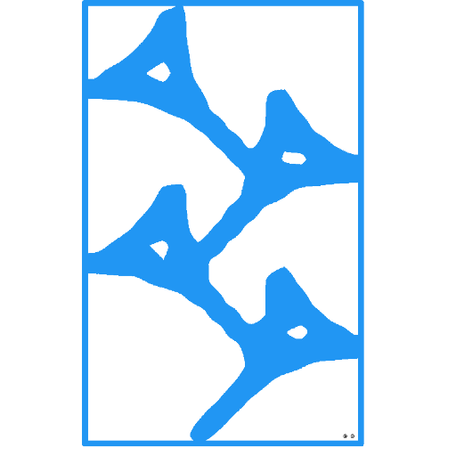

# About

[Dennis R. Gesker](https://linkedin.com/in/gesker) is a technology executive based in [Montana](https://en.wikipedia.org/wiki/Montana), [USA](https://en.wikipedia.org/wiki/United_States).

### Background

Having 30 years of experience in the information technology field Dennis is proficient in a number of core technologies covering the scope of the Open Systems Interconnection Model; OSI Model. 

More simply put Dennis supports the entire technology stack from hardware through to end user facing software systems including cloud systems design and security implementation strategies.

### Technology Portfolio

Candela Global is primarily a holding company for technologies developed by Dennis, his associates and clients.

Recently the intellectual property portfolio submitted two patent applications relating
to [revealed economic behavior](https://www.investopedia.com/terms/r/revealed-preference.asp) in social media systems
and
integrating [consensus based](https://hacken.io/discover/consensus-mechanisms/) [blockchain technologies](https://en.wikipedia.org/wiki/Blockchain)
with traditional [relational database systems](https://www.ibm.com/topics/relational-databases). These new portfolio
holdings are embodied in US Patent filing numbers 18/323408 and 18/323409 and the demonstrator technology code was
implemented in [Java](https://java.com)/[Quarkus](https://quarkus.io) and [Rust](https://www.rust-lang.org/) using
the [K3s](https://k3s.io/) implementation of [Kubernetes](https://kubernetes.io/).

### Current Activities

Dennis is presently engaged in supporting [Aveum Systems, Inc.](https://www.aveumsystems.com/) in formulating their
technological roadmap for developing massively scalable [DNA](https://en.wikipedia.org/wiki/DNA) information systems and
related technologies which will enable the construction of identity systems that are hyper-secure, cryptographically
rigorous, [AI](https://en.wikipedia.org/wiki/Artificial_intelligence)/[ML](https://en.wikipedia.org/wiki/Machine_learning)
backed and are at the same time AI resistant.

Aveum Systems, Inc. is a Delaware Corporation operating in the US and Europe targeting pilot programs in Africa and
the [Kingdom of Saudi Arabia](https://houseofsaud.com/).

## Trademarks

| **Quaerite Lux et Sapientia**                        |
|------------------------------------------------------|
|  |

**Zalag Logo** © 2020 Dennis R. Gesker. All Rights Reserved.\
**Zalag Logo**™ a registered trademark. All Right Reserved.

