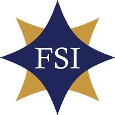

## Training and Certifications

---

---

### FCC - Federal Communications Commission

---

- [Amateur Radio License](https://www.fcc.gov/wireless/bureau-divisions/mobility-division/amateur-radio-service)
  - **2025-May**
  - Operator Privileges: **Amateur Extra**
  - Station Privileges: **Primary**
  - Call Sign: [NA1LS](pdf/FCC_General_NA1LS.pdf)

### Duke/Coursera/Remote

---

- [Rust Programming Specialization](pdf/DukeCoursera_RustProgrammingSpecialization.pdf)
  - Comprehensive Rust Specialization
  - **2025-May**
    - Software Engineering
    - Platform Engineering
    - MLOps Engineer
    - Data Engineering
    - Embedded Engineering
    - Backend Development

- [Data Engineering with Rust](pdf/DukeCoursera_DataEngineeringWithRust.pdf)
  - **2025-May**
  - Software Development
  - Data Engineering
  - Concurrent Rust Programming
  - Data Structures and Algorithms
  - Cloud Databases and Data Processing
  - SQL Optimization, Big Data
  - Diesel, Polars, Panda, Apache Arrow
  - REST, gRPC
  - AWS SDK, AWS Lambda, AWS EFS, AWS S3
  - Google Cloud

- [Rust for Large Language Model Operations (LLMOp)](pdf/DukeCoursera_RustForLargeLanguageModelOperations_LLMOps.pdf)
  - **2025-May**
  - Infrastructure as Code , IAAC
  - Automation and Tooling
  - Hugging Face
  - AWS Security Hub
  - Identity Access Management, IAM
  - LLMOps
  - Rust Candle & BERT with ONNX
  - Falcon LLM, Whisper LLM
  - AWS BigCode, AWS BedRock
  - PyTorch, Rust and PyTorch, Py

- [Rust for DevOps](pdf/DukeCoursera_RustForDevOps.pdf)
  - **2025-May**
  - Large Scale Applications
  - Linux, Git, and Docker

- [Rust Fundamentals](pdf/DukeCoursera_RustFundamentals.pdf)
  - **2025-May**
  - Development of reliable and high-performance applications

- [Python and Rust with Linux Command Line Tools](pdf/DukeCoursera_PythonAndRustWithLinuxCommandLineTools.pdf)
  - **2025-May**
  - Py03
  - Command Line Application Development
  - Code Structure
  - Logging and Error Handling

### TechStrong

---

- Evolution of Transactional Databases
  - **2023-Jan**

### Foreign Service Institute

---

- PN106 Orientation \- Foreign Service Specialist
- PS380 Introduction to Information Resource Management
- YW279 Department of State Applied Systems \-- MS-Active Directory & MS-Exchange
- YW119 Overseas Operations for IRM Classified Pouch Operations COMSEC and CRYPTO
- YW533 S.M.A.R.T System Admin Diplomatic Communication and Cables
- YW278 Citrix Metaframe Presentation Server Admin (Earned Citrix Administrator Certificate)
- YW302 FASTNet Post Operation and Maintenance
- YW268 UHF/VHF Emergency and Evacuation
- YW142 Basic Telephone \- Nortel/Avaya Norstar Key System Programming
- YW286 Simulated Operations
- YW497 Nortel/Avaya Meridian 61C/11C
- YW496 Nortel CallPilot
- MQ911 Security Overseas Seminar
