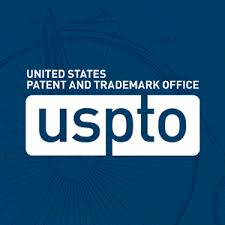

### [Patents Pending](https://uspto.gov)

---

---

### Systems and Methods for Distributed Blockchain Monitoring and Inherent Latency Compensation

---

**Filed**: 2023-May-25\
**Application Number**: 18/323408\
**Document**: US-20240303665-A1\
**Abstract**:

Methods, systems and computer readable media for managing (e.g., queuing, batching, submission, and logging) and monitoring distributed blockchain operations such as cryptocurrency operations and transactions by client application systems and end users of a client application system to compensate for the inherent latency in distributed blockchain systems.

### Systems and Methods for Economic Price Discovery In Social Media Networks Including Games

---

**Filed**: 2023-May-25\
**Application Number**: 18/323409\
**Document**: TBD\
**Abstract**:

Methods, systems and computer readable media for economic price discovery in social media
networks including games are described. For example, a system and method can include
assessing content, enhancing the quality of end user interaction, and overall utility of a social
media network or information system by performing price discovery utilizing a user interface
and price discovery mechanism among assessment controls utilized on a social media platform
or application.
